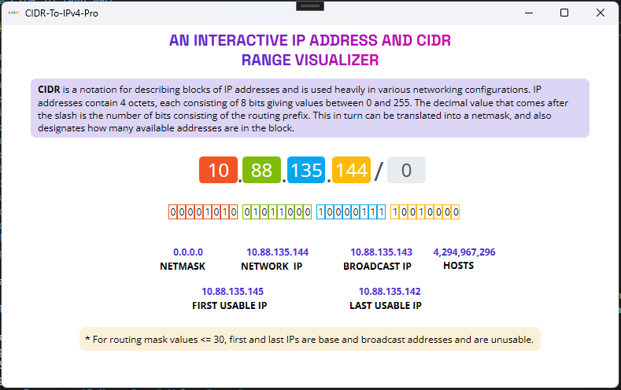

**National University of Technology**

{width="2.8125in" height="2.8125in"}

Computer Science Department

Semester Fall -- 2023

**PROJECT REPORT**

Course: Computer Networks

Course Code: CS4016

Submitted By:

+-------------------------------------------+--------------------------+
| **Arshad Ali**                            | **F20605040**            |
|                                           |                          |
| **Umer Adbullah**                         | **F20605044**            |
|                                           |                          |
| **Ans Shahid Chaudhry**                   | **F20605045**            |
+===========================================+==========================+
+-------------------------------------------+--------------------------+

Report Title: CIDR-To-IPv4-Pro Application

# Contents {#contents .TOC-Heading}

[Introduction: [3](#introduction)](#introduction)

[User Interface Components:
[3](#user-interface-components)](#user-interface-components)

[Binary Representation Visualization:
[4](#binary-representation-visualization)](#binary-representation-visualization)

[Input Fields for IP Address and CIDR Suffix:
[4](#input-fields-for-ip-address-and-cidr-suffix)](#input-fields-for-ip-address-and-cidr-suffix)

[Calculation of Netmask, Base IP, Broadcast IP, Count, First IP, and
Last IP:
[5](#calculation-of-netmask-base-ip-broadcast-ip-count-first-ip-and-last-ip)](#calculation-of-netmask-base-ip-broadcast-ip-count-first-ip-and-last-ip)

[Styling and Design: [5](#styling-and-design)](#styling-and-design)

[Conclusion: [6](#conclusion)](#conclusion)

[References [6](#references)](#references)

# Introduction: 

CIDR-To-IPv4-Pro is a visually interactive application designed to
facilitate understanding of Classless Inter-Domain Routing (CIDR)
notation and IPv4 addressing. Through a well-crafted user interface, it
enables users to input CIDR notations and IP addresses, visually
displaying binary representations while calculating essential details
like netmask, base IP, broadcast IP, count, first usable IP, and last
usable IP. The application enhances learning and comprehension of
networking concepts by providing an intuitive interface for exploring
and visualizing IP address information within CIDR notation.Top of Form

{width="6.5in"
height="4.086111111111111in"}

# User Interface Components: {#user-interface-components .HeadingCUSTOM}

-   **Text Blocks:** The application contains descriptive text blocks
    that explain CIDR notation and its significance in networking. These
    blocks use gradients and different font families to enhance
    readability.

-   **Text Boxes:** Various text boxes are present to display key
    information:

    -   Netmask, Base IP, Broadcast IP, Count, First Usable IP, Last
        Usable IP.

    -   These boxes are styled with specific fonts, colors, and
        read-only attributes for clarity and user interaction
        limitations.

{width="4.5006277340332455in"
height="1.177247375328084in"}

# Binary Representation Visualization: {#binary-representation-visualization .HeadingCUSTOM}

-   **Stack Panels with Text Boxes:** There are multiple stack panels
    containing text boxes to represent the binary format of IP address
    bits.

-   Each text box in these panels appears to represent individual bits
    in an IP address. The arrangement mimics the binary representation
    of an IP address.

{width="4.010976596675415in"
height="0.3750524934383202in"}

# Input Fields for IP Address and CIDR Suffix: {#input-fields-for-ip-address-and-cidr-suffix .HeadingCUSTOM}

-   **Decimal Representation of IP Address:** Text boxes are provided
    for users to input individual octets of an IP address in decimal
    format.

-   **CIDR Suffix:** An additional text box allows users to input the
    CIDR suffix (the number after \'/\').

{width="3.4796522309711286in"
height="0.625087489063867in"}

# Calculation of Netmask, Base IP, Broadcast IP, Count, First IP, and Last IP: {#calculation-of-netmask-base-ip-broadcast-ip-count-first-ip-and-last-ip .HeadingCUSTOM}

-   **Netmask Calculation:** The netmask is calculated from the CIDR
    suffix. It determines the number of bits set in the subnet mask,
    e.g., CIDR /24 corresponds to a netmask of 255.255.255.0.

-   **Base IP Calculation:** The base IP address represents the starting
    address of the subnet. It is obtained by performing a bitwise AND
    operation between the IP address and the netmask.

-   **Broadcast IP Calculation:** The broadcast IP address is the last
    address in the subnet and is calculated by performing a bitwise OR
    operation between the base IP address and the inverted netmask.

-   **Count Calculation:** The count represents the number of available
    IP addresses in the subnet and is calculated as 2 raised to the
    power of (32 - CIDR suffix).

-   **First Usable IP Calculation:** The first usable IP address in the
    subnet is the base IP address plus 1.

-   **Last Usable IP Calculation:** The last usable IP address in the
    subnet is the broadcast IP address minus 1.

{width="4.5006277340332455in"
height="1.177247375328084in"}

# Styling and Design: {#styling-and-design .HeadingCUSTOM}

-   The UI is designed using specific styles, triggers, and templates
    for consistent and visually appealing elements.

-   Ellipses are used to visually separate octets of the IP address.

{width="6.5in"
height="4.085416666666666in"}

# **Conclusion:** {#conclusion .HeadingCUSTOM}

The designed UI provides a comprehensive display of CIDR-related
information, enabling users to understand and visualize IP address
details in both decimal and binary formats. The layout and styling
enhance user interaction and readability.

# References {#references .HeadingCUSTOM}

[*https://en.wikipedia.org/wiki/Classless_Inter-Domain_Routing*](https://en.wikipedia.org/wiki/Classless_Inter-Domain_Routing)

[*https://mxtoolbox.com/subnetcalculator.aspx*](https://mxtoolbox.com/subnetcalculator.aspx)

[*https://www.ipaddressguide.com/cidr*](https://www.ipaddressguide.com/cidr)

[*https://www.digitalocean.com/community/tutorials/understanding-ip-addresses-subnets-and-cidr-notation-for-networking*](https://www.digitalocean.com/community/tutorials/understanding-ip-addresses-subnets-and-cidr-notation-for-networking)
